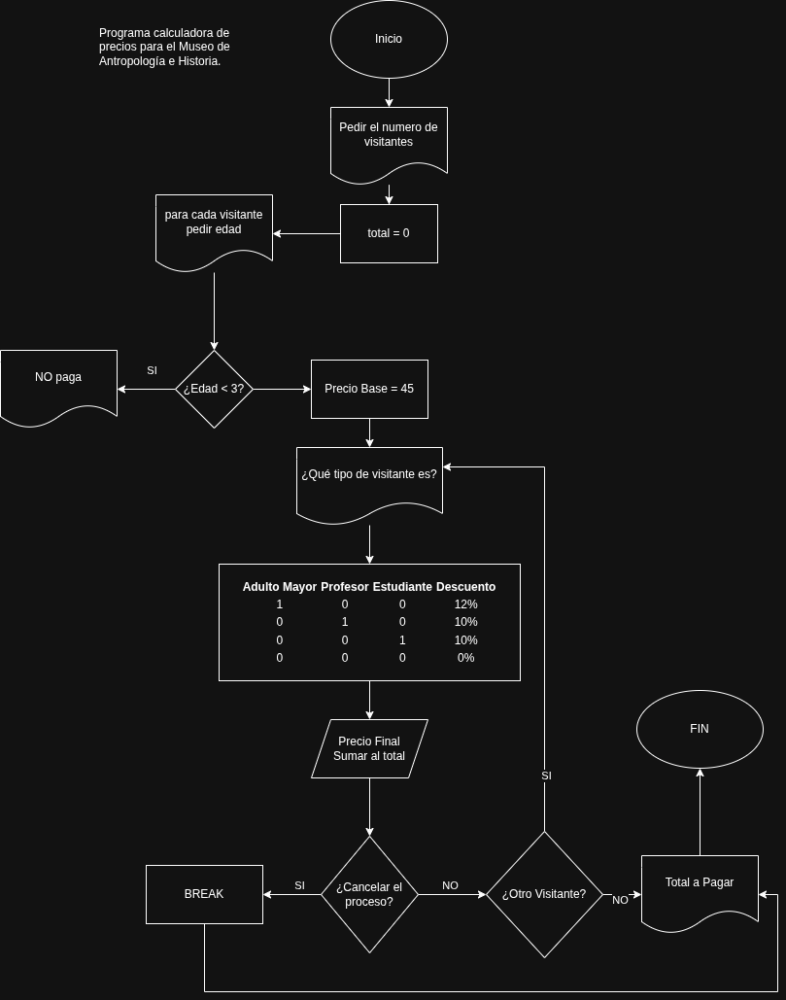

]

# ACTIVIDAD 4
## 📚 Aplicación de Estructuras de Datos en Python

Aplicación de consola desarrollada en Python que demuestra el uso de estructuras de datos fundamentales mediante un menú interactivo.

El programa permite capturar, almacenar y administrar información usando:
- Tuplas
- Diccionarios
- Manejo de excepciones
- Strings
- Funciones
- Entrada de usuario
- Menú principal interactivo

---

## 🎯 Objetivo

Desarrollar una aplicación en Python que integre distintas estructuras de datos y mecanismos de control para procesar información ingresada por el usuario de forma segura y organizada.

---

## ⚙️ Requisitos del sistema

- Python 3.x instalado
- Terminal o consola de comandos

Para verificar Python:

```bash
python --version